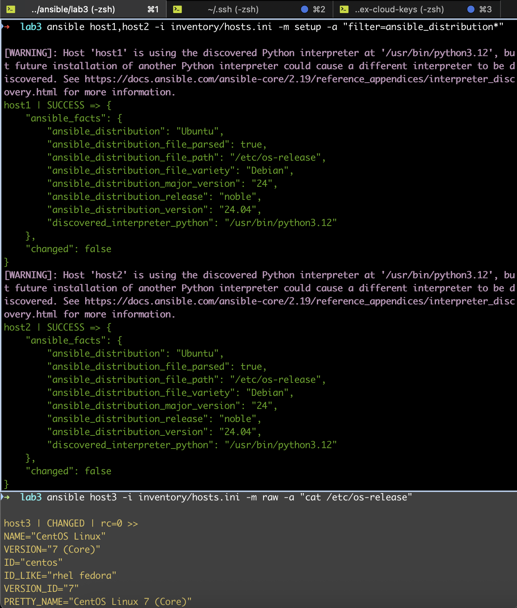
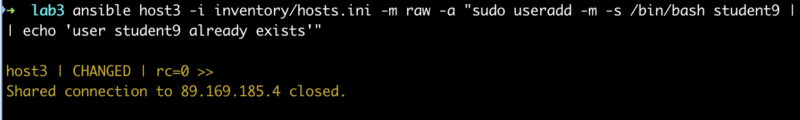
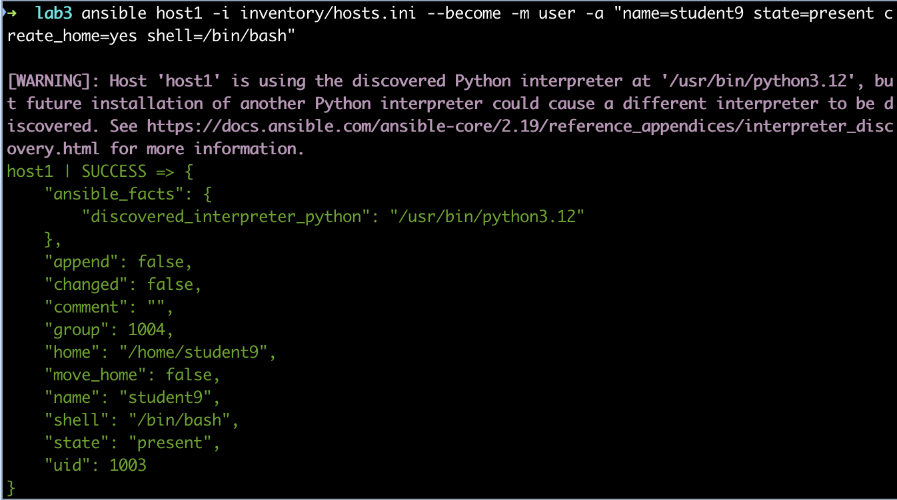
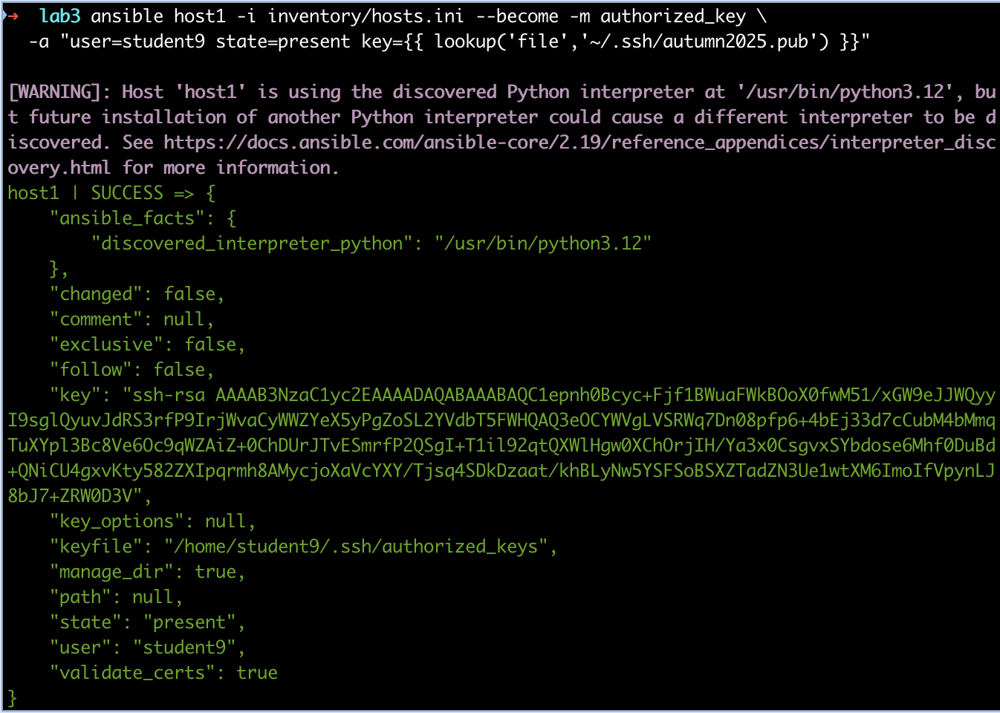
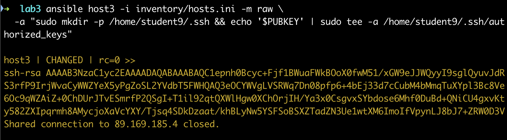

## Практика 1

### 1а. Получить факты о системе

- Для **host1 (Ubuntu)** модуль `setup`:

```bash
ansible host1 -i inventory/hosts.ini -m setup -a "filter=ansible_distribution*"
```

- Для **host3 (CentOS 7)** модуль `setup` не работает (Python старый), поэтому используется `raw`:

```bash
ansible host3 -i inventory/hosts.ini -m raw -a "cat /etc/os-release"
```

#### Полученный результат:

host1: Ubuntu 24.04  


host3: CentOS Linux 7 (Core)  


### 1б. Создать пользователя `student9`

- Для **host1 (Ubuntu)**:

```bash
ansible host1 -i inventory/hosts.ini --become -m user -a "name=student9 state=present create_home=yes shell=/bin/bash"
```

Note: пользователь существует `changed: false` (был добавлен в предыдущей лабораторной).


- Для **host3 (CentOS 7)** через `raw`:

```bash
ansible host3 -i inventory/hosts.ini -m raw -a "sudo useradd -m -s /bin/bash student9 || echo 'user student9 already exists'"
```

Вывод: `changed: true` → пользователь создан.


### 1в. Добавить публичный ключ пользователю `student9`

Публичный ключ: `~/.ssh/autumn2025.pub`

- Для **host1 (Ubuntu)** модуль `authorized_key`:

```bash
ansible host1 -i inventory/hosts.ini --become -m authorized_key   -a "user=student9 state=present key={{ lookup('file','~/.ssh/autumn2025.pub') }}"
```

Note: пользователь существует `changed: false` (был добавлен в предыдущей лабораторной).


- Для **host3 (CentOS 7)** через `raw` и переменную `PUBKEY`:

```bash
PUBKEY=$(cat ~/.ssh/autumn2025.pub)
ansible host3 -i inventory/hosts.ini -m raw   -a "sudo mkdir -p /home/student9/.ssh && echo '$PUBKEY' | sudo tee -a /home/student9/.ssh/authorized_keys"
```

Вывод: ключ успешно добавлен.


Итог: теперь пользователь `student9` существует на host1 и host3 и имеет SSH-ключ.

## Практика 2

### 2.1. Вынести переменные в `group_vars`

Структура:

```
inventory/
  hosts.ini
  group_vars/
    hosts.yml
```

**hosts.ini**:

```ini
[hosts]
host1 ansible_host=89.169.180.219
host2 ansible_host=89.169.165.97
host3 ansible_host=89.169.185.4
```

**group_vars/hosts.yml**:

```yaml
ansible_user: student
ansible_ssh_private_key_file: ~/.ssh/autumn2025
```

### 2.2. Вывести дистрибутив и IP

Playbook `facts.yml`

### 2.3. Вывести дистрибутив и IP

Playbook `install-joe.yml`

### Дополнительно для практики playbook:

- Добавить ключ пользователю `student9` на всех хостах – playbook `add-key-student9.yml`:

- Создать пользователя `student9` на всех хостах – playbook `create-student9.yml`:
